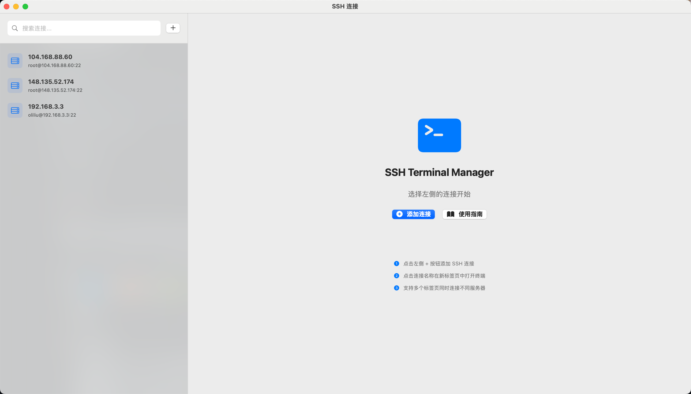
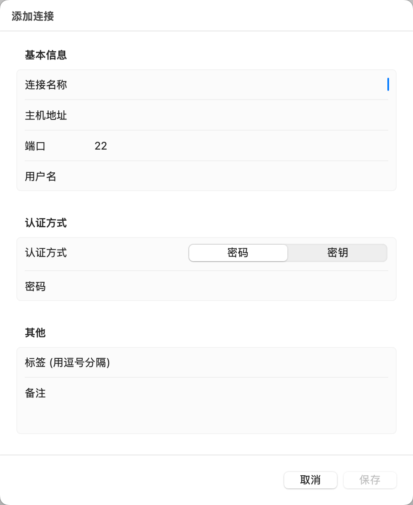

# SSH Terminal Manager

<p align="center">
  
</p>

一个基于 SwiftUI 和 SwiftTerm 构建的现代化 macOS SSH 连接管理工具，支持多标签页、内置终端和智能连接管理。


<p align="center">
  
  
</p>

## ✨ 特性

### 🚀 核心功能
- **多标签页终端**：在同一窗口中管理多个 SSH 连接
- **内置终端**：基于 SwiftTerm 的原生终端体验
- **智能连接管理**：保存和组织您的 SSH 连接配置
- **双重认证支持**：密码认证和 SSH 密钥认证
- **安全存储**：使用 macOS Keychain 安全存储密码

### 💡 便捷特性
- **快速搜索**：实时搜索连接名称、主机地址和用户名
- **标签筛选**：使用自定义标签组织和筛选连接
- **外部终端支持**：支持在系统 Terminal 或 iTerm2 中打开连接
- **自动重连**：连接断开时一键重连
- **导入/导出**：轻松备份和迁移连接配置

### 🎨 用户体验
- **现代化界面**：原生 macOS 设计风格
- **实时状态指示**：连接状态的可视化反馈
- **中文界面**：完整的中文本地化
- **智能提示**：首次使用时的引导和帮助

## 📸 截图

<details>
<summary>点击查看应用截图</summary>

```
┌─────────────────────────────────────────────────────────┐
│  连接列表                │  终端标签页                   │
│  ├─ 生产服务器          │  ┌───────────────────────┐   │
│  ├─ 开发环境            │  │ ● 生产服务器          │   │
│  └─ 测试服务器          │  └───────────────────────┘   │
│                         │                              │
│  [搜索框]  [+ 添加]    │  [终端输出区域]              │
│                         │                              │
│  标签: [全部] [生产]    │  user@host:~$ _              │
│       [开发] [测试]     │                              │
└─────────────────────────────────────────────────────────┘
```

</details>

## 🚀 快速开始

### 系统要求
- macOS 11.0 (Big Sur) 或更高版本
- Xcode 13.0 或更高版本

### 安装步骤

1. **克隆仓库**
```bash
git clone https://github.com/liseipi/SSHTerminal.git
cd SSHTerminal
```

2. **打开项目**
```bash
open SSHTerminal.xcodeproj
```

3. **配置签名**
    - 在 Xcode 中选择项目
    - 选择 Target "SSHTerminal"
    - 在 "Signing & Capabilities" 中配置您的开发团队

4. **构建运行**
    - 按 `Cmd + R` 运行项目
    - 或选择 Product > Run

### 首次使用

1. **添加连接**
    - 点击左上角的 `+` 按钮
    - 填写连接信息（名称、主机、端口、用户名）
    - 选择认证方式（密码或密钥）
    - 点击"保存"

2. **连接服务器**
    - 双击连接项打开内置终端
    - 或右键选择"在系统终端打开"

3. **管理连接**
    - 使用搜索框快速查找
    - 使用标签筛选分组
    - 右键菜单进行编辑或删除

## 📖 使用指南

### 认证方式

#### 密码认证
1. 选择"密码"认证方式
2. 输入 SSH 登录密码
3. 密码将安全存储在 macOS Keychain 中
4. 首次使用时可能需要授权访问 Keychain

**重要提示**：
- 首次访问密码时，请点击"**始终允许**"而不是"允许"
- 这样可以避免每次连接都弹出授权提示

#### SSH 密钥认证（推荐）
1. 生成密钥对（如果还没有）：
```bash
ssh-keygen -t ed25519 -C "your_email@example.com"
```

2. 上传公钥到服务器：
```bash
ssh-copy-id user@host
```

3. 在应用中选择"密钥"认证方式
4. 选择私钥文件（通常在 `~/.ssh/id_ed25519`）

**优势**：
- 更安全
- 无需存储密码
- 无需 Keychain 授权
- 支持无密码登录

### 标签管理

标签可以帮助您组织大量的 SSH 连接：

1. **添加标签**：在创建或编辑连接时，在"标签"字段输入标签名，用逗号分隔
   ```
   生产, 重要, Web服务器
   ```

2. **筛选标签**：点击搜索框下方的标签按钮快速筛选

3. **常用标签示例**：
    - 按环境：`生产`, `开发`, `测试`
    - 按项目：`项目A`, `项目B`, `客户X`
    - 按重要性：`重要`, `常用`, `备用`

### 多标签页终端

1. **打开新标签页**：双击连接项
2. **切换标签页**：点击顶部标签栏
3. **关闭标签页**：
    - 点击标签上的 `×` 按钮
    - 或点击工具栏的断开按钮
4. **重新连接**：点击工具栏的刷新按钮

### 导入/导出

#### 导出连接
1. 菜单栏 → File → 导出连接
2. 选择保存位置
3. 文件格式：JSON

#### 导入连接
1. 菜单栏 → File → 导入连接
2. 选择之前导出的 JSON 文件
3. 重复的连接将被跳过

**提示**：可以用于在不同设备间同步连接配置

### 快捷键

| 快捷键 | 功能 |
|--------|------|
| `Cmd + N` | 新建连接 |
| `Cmd + Shift + I` | 导入连接 |
| `Cmd + Shift + E` | 导出连接 |
| `Cmd + ,` | 打开设置 |
| `Cmd + C` | 复制选中文本 |
| `Cmd + V` | 粘贴 |

## ⚙️ 配置说明

### 设置选项

在设置界面（`Cmd + ,`）中，您可以配置：

1. **默认终端应用**
    - Terminal（系统自带）
    - iTerm2（如果已安装）

2. **行为设置**
    - 自动更新最后使用时间

### 权限配置

应用需要以下权限：

- **网络访问**：用于建立 SSH 连接
- **文件访问**：用于读取 SSH 密钥文件
- **Keychain 访问**：用于安全存储密码

**注意**：本应用已禁用 App Sandbox 以支持完整的 SSH 功能。

## 🔧 故障排查

### 常见问题

#### 1. 无法打开内置终端
**原因**：权限配置问题

**解决方案**：
- 检查是否禁用了 App Sandbox
- 确认网络权限已授予

#### 2. 密码自动登录失败
**可能原因**：
- 密码不正确
- 服务器地址或端口错误
- 服务器禁用了密码认证

**解决方案**：
- 检查连接配置是否正确
- 尝试手动 SSH 连接验证
- 考虑使用 SSH 密钥认证

#### 3. Keychain 重复授权提示

**解决方法 1**：在弹窗中点击"**始终允许**"（而不是"允许"）

**解决方法 2**：修改 Keychain 权限
1. 打开"钥匙串访问"应用
2. 搜索 "com.sshterminal.passwords"
3. 双击密码项
4. 切换到"访问控制"标签
5. 选择"允许所有应用程序访问此项目"

**解决方法 3**：改用 SSH 密钥认证（推荐）

## 🏗️ 技术架构

### 核心技术栈
- **SwiftUI**：构建用户界面
- **SwiftTerm**：终端模拟器引擎
- **Combine**：响应式编程
- **Keychain Services**：安全存储

### 项目结构
```
SSHTerminal/
├── Models/
│   └── SSHConnection.swift          # 连接数据模型
├── Services/
│   ├── ConnectionStorage.swift      # 连接存储管理
│   ├── KeychainService.swift        # Keychain 密码管理
│   ├── SwiftTermSSHManager.swift    # SSH 会话管理
│   └── TerminalLauncher.swift       # 外部终端启动器
├── Views/
│   ├── ConnectionListView.swift     # 主界面
│   ├── AddConnectionSheet.swift     # 添加/编辑连接
│   └── SwiftTerminalView.swift      # 内置终端视图
├── SSHTerminalApp.swift             # 应用入口
└── SSHTerminal.entitlements         # 权限配置
```

### 设计模式
- **MVVM**：视图模型分离
- **观察者模式**：使用 `@Published` 和 `@ObservedObject`
- **单例模式**：共享服务（Storage, Keychain）
- **协调者模式**：SwiftTerm 集成

## 📝 更新日志

### v1.0.0 (当前版本)
- ✨ 初始版本发布
- 🎯 内置终端支持
- 🔐 双重认证（密码/密钥）
- 📋 多标签页管理
- 🏷️ 标签筛选功能
- 💾 导入/导出配置
- 🌏 完整中文支持

### 计划中的功能
- [ ] SFTP 文件传输
- [ ] 终端主题自定义
- [ ] 连接分组管理
- [ ] 快速命令模板
- [ ] 会话记录
- [ ] iCloud 同步

## 📄 许可证

本项目采用 MIT 许可证 - 详见 [LICENSE](LICENSE) 文件

## 🙏 致谢

- [SwiftTerm](https://github.com/migueldeicaza/SwiftTerm) - 优秀的终端模拟器库
- [Apple 开发者文档](https://developer.apple.com/documentation/) - 详尽的技术文档

## 📧 联系方式

- GitHub：[@liseipi](https://github.com/liseipi)
- 项目主页：[https://github.com/liseipi/SSHTerminal](https://github.com/liseipi/SSHTerminal)

---

⭐️ 如果这个项目对您有帮助，欢迎给个 Star！
